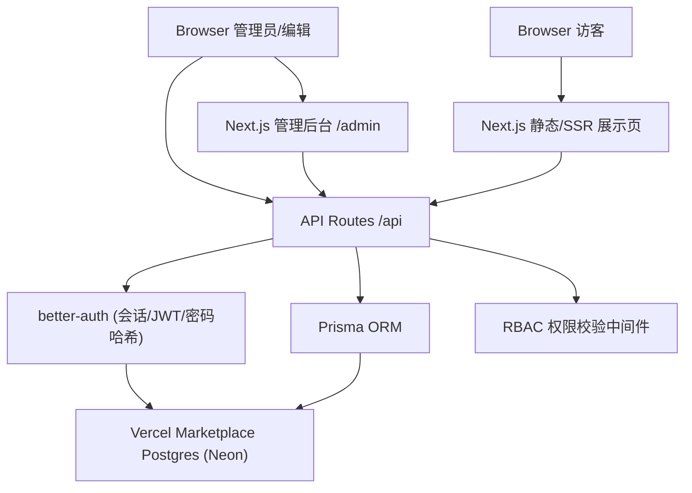
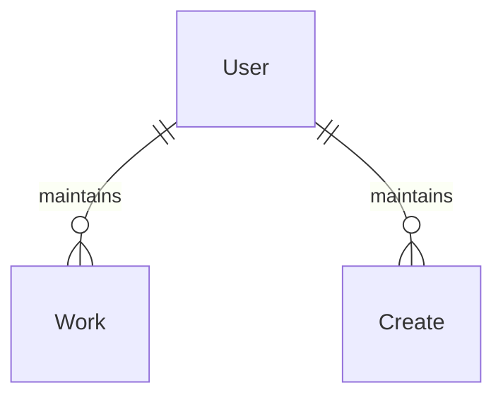

# 用户管理与权限分离（User Management RBAC）

Feature Name: user-management-rbac
Updated: 2026-08-16

## Description

在现有纯静态个人作品集站点基础上，引入用户管理与基于角色的权限分离（RBAC）。将项目迁移至 Next.js（App Router），后端逻辑以 API Routes 提供，认证使用 better-auth，数据存储使用 Vercel Marketplace Postgres（Neon）。角色分为 admin / editor / visitor，账号仅由管理员创建，访客不可自助注册。

现有展示页面（index / works / creates / about / contact / export 及作品详情页）保留为公开只读内容；新增管理后台用于内容管理与用户管理。

## Architecture

架构说明：
- **展示层**：现有 HTML 页面迁移至 Next.js，作为公开只读内容，无需登录即可访问。
- **管理后台**：新增 `/admin` 路由组，登录后访问；按角色渲染用户管理与内容管理界面。
- **API 层**：`/api` 下的 API Routes 处理认证、用户 CRUD、内容 CRUD；所有写操作经 RBAC 校验。
- **认证**：better-auth 负责登录、会话令牌、密码哈希、角色信息。
- **数据**：Prisma ORM 连接 Vercel Marketplace Postgres；迁移由 Prisma Migrate 管理。

## Components and Interfaces

### 1. Next.js 展示页（迁移自现有 HTML）

- 公开路由：`/`、`/works`、`/creates`、`/about`、`/contact`、`/export`、`/work/[slug]`
- 现有 `assets/css`、`assets/js/ambient.js` 迁移至组件化样式与客户端组件
- 内容由数据库提供，页面在服务端读取后渲染，未登录访问仅得公开内容

### 2. 管理后台（/admin 路由组）

| 接口 | 方法 | 角色 | 说明 |
|------|------|------|------|
| `/admin` | GET | admin, editor | 管理后台首页 |
| `/admin/users` | GET | admin | 用户列表（邮箱、角色、状态、创建时间） |
| `/admin/users` | POST | admin | 创建用户（邮箱、初始密码、角色） |
| `/admin/users/[id]` | PATCH | admin | 修改角色、重置密码、停用/启用 |
| `/admin/works` | GET | admin, editor | 作品列表 |
| `/admin/works` | POST | admin, editor | 创建作品 |
| `/admin/works/[id]` | PUT/DELETE | admin, editor | 修改/删除作品 |
| `/admin/creates` | GET/POST | admin, editor | 创作条目列表/创建 |
| `/admin/creates/[id]` | PUT/DELETE | admin, editor | 修改/删除创作条目 |

### 3. API Routes（/api）

| 接口 | 方法 | 权限 | 说明 |
|------|------|------|------|
| `/api/auth/*` | 多方法 | 公开 | better-auth 认证端点（登录、登出、会话查询） |
| `/api/admin/users` | GET/POST | admin | 用户管理 |
| `/api/admin/users/[id]` | PATCH/DELETE | admin | 用户管理 |
| `/api/admin/works` | GET/POST | GET 需登录，POST 需 editor+ | 作品管理 |
| `/api/admin/works/[id]` | PUT/DELETE | editor+ | 作品管理 |
| `/api/admin/creates` | GET/POST | GET 需登录，POST 需 editor+ | 创作管理 |
| `/api/admin/creates/[id]` | PUT/DELETE | editor+ | 创作管理 |
| `/api/content` | GET | 公开 | 展示页内容读取（只读） |

### 4. 认证与权限中间件

- **认证**：better-auth 会话校验；API 中通过 `getSession()` 获取当前用户与角色。
- **RBAC 校验**：封装 `requireRole(roles)` 高阶函数；未登录返回 401，角色不足返回 403。
- **会话失效**：用户停用时更新用户状态，better-auth 会话校验同时检查状态字段，停用即拒绝。

## Data Models

### User

| 字段 | 类型 | 说明 |
|------|------|------|
| id | String (uuid) | 主键 |
| email | String | 唯一，登录标识 |
| passwordHash | String | better-auth 管理 |
| role | Enum(admin, editor, visitor) | 角色 |
| status | Enum(active, disabled) | 状态 |
| createdAt | DateTime | 创建时间 |
| updatedAt | DateTime | 更新时间 |

### Work（作品）

| 字段 | 类型 | 说明 |
|------|------|------|
| id | String (uuid) | 主键 |
| slug | String | URL 标识，唯一 |
| title | String | 标题 |
| summary | String | 简介 |
| coverImage | String | 封面图 |
| body | Text | 正文/详情 |
| published | Boolean | 是否发布 |
| createdAt / updatedAt | DateTime | 时间戳 |

### Create（创作条目）

| 字段 | 类型 | 说明 |
|------|------|------|
| id | String (uuid) | 主键 |
| title | String | 标题 |
| image | String | 图片 |
| caption | String | 说明 |
| createdAt / updatedAt | DateTime | 时间戳 |

### 关系

## Correctness Properties

1. 任意时刻数据库中至少存在一个启用的 admin 用户。
2. 用户邮箱全局唯一；同邮箱创建请求被拒绝。
3. editor 角色不能执行任何用户管理操作（用户 CRUD 仅 admin 可用）。
4. 停用用户后，其现有会话立即失效，后续请求被拒绝。
5. 内容管理写操作（创建/修改/删除）仅 editor 及以上角色可执行；访客请求返回 403。
6. 密码仅以加盐哈希存储，任何接口不返回密码哈希。
7. 公开展示内容与登录用户读取的内容一致，不泄露未发布内容（未发布内容仅登录后可见）。

## Error Handling

| 场景 | HTTP 状态 | 响应说明 |
|------|-----------|----------|
| 未登录访问受保护 API | 401 | 提示需登录 |
| 登录成功但角色不足 | 403 | 提示无权限 |
| 创建用户邮箱重复 | 409 | 提示邮箱已存在 |
| 停用最后一个启用管理员 | 422 | 拒绝操作并提示 |
| 提交数据校验失败 | 400 | 返回字段级错误 |
| 数据库连接/操作失败 | 500 | 返回通用错误，记录日志 |
| better-auth 登录失败 | 401 | 凭据错误提示 |
| 多次登录失败 | 429 | 限流提示 |

## Test Strategy

1. **单元测试**：RBAC 权限校验函数（requireRole）各角色组合；密码哈希与验证逻辑。
2. **API 集成测试**：认证流程（登录/登出/会话）；用户 CRUD 的权限矩阵；内容 CRUD 的权限矩阵。
3. **数据库测试**：迁移可重复执行；正确性属性验证（唯一邮箱、最后一个 admin 保护）。
4. **端到端测试**：管理员登录 → 创建 editor → editor 登录 → 维护作品 → 访客仅读 → 停用用户会话失效。
5. **安全测试**：未授权访问受保护端点返回 401/403；暴力破解限流生效。

## References

[^1]: (Vercel Marketplace) - [Vercel with Neon Postgres 模板](https://vercel.com/new/nymbo/templates/next.js/vercel-with-neon-postgres)
[^2]: (better-auth) - 认证库，处理会话、JWT 与密码哈希
[^3]: (Prisma) - ORM 与迁移工具，连接 Vercel Marketplace Postgres
[^4]: (Vercel) - [Docker Compose 概念映射到 Vercel 原语](https://vercel.com/kb/guide/docker-compose-concepts-on-vercel)
